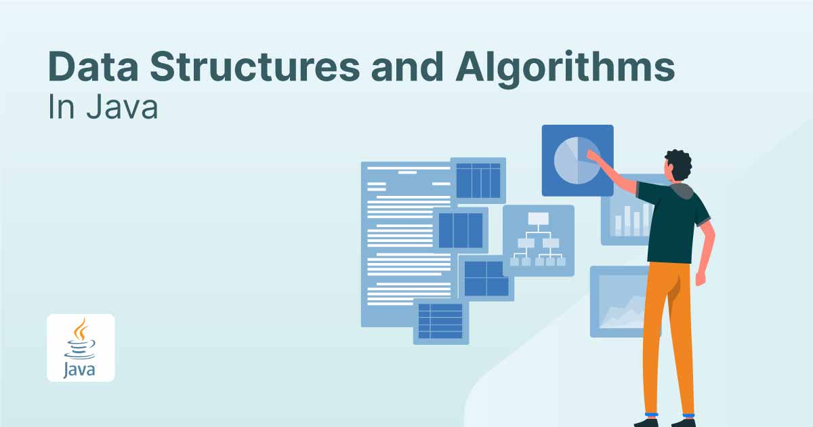

# Data Structures and Algorithms in Java

This repository serves as a comprehensive guide and learning resource for implementing various data structures and algorithms in Java. It includes practical examples and detailed explanations to help both beginners and advanced programmers understand how these structures and algorithms can be utilized in real-world applications.

## Authors

- [@AdrianTalonia](https://github.com/adriantalonia) - Java Fullstack Developer

## Tech Stack

- Java 21

## Data Structures Covered

This repository includes a range of fundamental and advanced data structures:

- Arrays
- Linked Lists
- Stacks
- Queues
- Hash Tables
- Heaps
- Graphs
- Trees
    - Binary Trees
    - AVL Trees
    - Red-Black Trees
    - Segment Trees
    - Fenwick Trees (Binary Indexed Trees)

## Algorithms Covered

In addition to data structures, this repository also covers a variety of algorithms:

- Sorting algorithms
    - Quick Sort
    - Merge Sort
    - Heap Sort
    - Bubble Sort
    - Insertion Sort
- Search algorithms
    - Binary Search
    - Depth-First Search (DFS)
    - Breadth-First Search (BFS)
- Graph algorithms
    - Dijkstra's Algorithm
    - A* Search
    - Bellman-Ford Algorithm
- Dynamic Programming
    - Fibonacci Series
    - Knapsack Problem
    - Longest Common Subsequence

## Installation and Usage

Ensure you have Java 21 installed on your machine