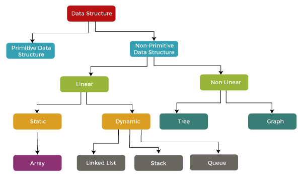

# Non-Primitive Data Structure

Data structures are essential components that help organize and store data efficiently in computer memory. They provide a way to manage and manipulate data effectively, enabling faster access, insertion, and deletion operations.

Common data structures include a**rrays, linked lists, stacks, queues, trees, and graphs** , each serving specific purposes based on the requirements of the problem. 
Understanding data structures is fundamental for designing efficient algorithms and optimizing software performance.

## What is a Data Structure?
A data structure is a way of organizing and storing data in a computer so that it can be accessed and used efficiently. It defines the relationship between the data and the operations that can be performed on the data

## Why are Data Structures Important?
Data structures are essential for the following reasons:

Efficient Data Management: They enable efficient storage and retrieval of data, reducing processing time and improving performance.
Data Organization: They organize data in a logical manner, making it easier to understand and access.
Data Abstraction: They hide the implementation details of data storage, allowing programmers to focus on the logical aspects of data manipulation.
Reusability: Common data structures can be reused in multiple applications, saving time and effort in development.
Algorithm Optimization: The choice of the appropriate data structure can significantly impact the efficiency of algorithms that operate on the data.

## Classification of Data Structures
Data structures can be classified into two main categories:

1) **Linear Data Structures**: These structures store data in a sequential order this allowing for easy insertion and deletion operations. Examples include 
   - arrays
   - linked lists
   - queues
   - stacks
2) **Non-Linear Data Structures**: These structures store data in a hierarchical or interconnected manner this allowing for more complex relationships between data elements. Examples include 
   - trees
   - graphs 
   - hash tables

## Linear Data Structures:
- **[Array](_01_linear_data_structure/_01_array/README.md)🔗:**  A collection of elements of the same type stored in contiguous memory locations.
- **[Linked List](_01_linear_data_structure/_02_linked_list/README.md)🔗:** A collection of elements linked together by pointers, allowing for dynamic insertion and deletion.
- **Queue:** A First-In-First-Out (FIFO) structure where elements are added at the end and removed from the beginning.
- **Stack:** A Last-In-First-Out (LIFO) structure where elements are added and removed from the top.

## Non-Linear Data Structures:
- **Tree:** A hierarchical structure where each node can have multiple child nodes.
- **Graph:** A collection of nodes connected by edges, representing relationships between data elements.
- **Hash Table:** A data structure that uses a hash function to map keys to values, allowing for fast lookup and insertion.

## Overview of Data Structures

| Data Structure | Advantages                                                                                    | Disadvantages                                                          |
|----------------|-----------------------------------------------------------------------------------------------|------------------------------------------------------------------------|
| Array          | Quick insertion, very fast access if index known                                              | Slow search, slow deletion, fixed size                                 |
| Ordered array  | Quicker search than unsorted array.                                                           | Slow insertion and deletion, fixed size.                               |
| Stack          | Provides last-in, first-out access.                                                           | Slow access to other items.                                            |
| Queue          | Provides first-in, first-out access.                                                          | Slow access to other items.                                            |
| Linked list    | Quick insertion, quick deletion.                                                              | Slow search.                                                           |
| Binary tree    | Quick search, insertion, deletion (if tree remains balanced).                                 | Deletion algorithm is complex.                                         |
| Red-black tree | Quick search, insertion, deletion. Tree always balanced.                                      | Complex.                                                               |
| 2-3-4 tree     | Quick search, insertion, deletion. Tree always balanced. Similar trees good for disk storage. | Complex.                                                               |
| Hash table     | Very fast access if key known. Fast insertion.                                                | Slow deletion, access slow if key not known, inefficient memory usage. |
| Heap           | Fast insertion, deletion, access to largest item.                                             | Slow access to other items.                                            |
| Graph          | Models real-world situations.                                                                 | Some algorithms are slow and complex.                                  |
